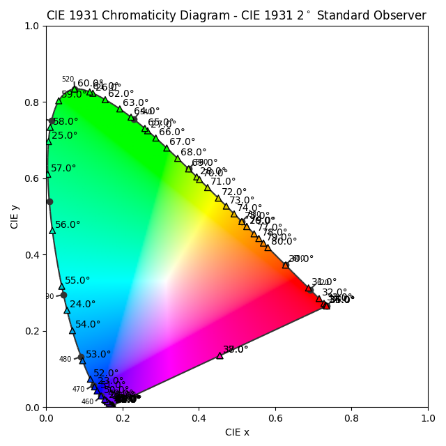

# Calculation of Structural Colors from Periodic Gratings

Run main.py to choose program. The programs to choose from are listed below.  

## Program 1: Diffraction Orders Overview

## Program 2: Rotate Viewing Angle Plot

## Program 3: CIE View Plot

# Make rotatinator figure
1. Go to plot_rotatinator_figure.py
2. Specify patch and resolution of calcluated frames
3. Run file

