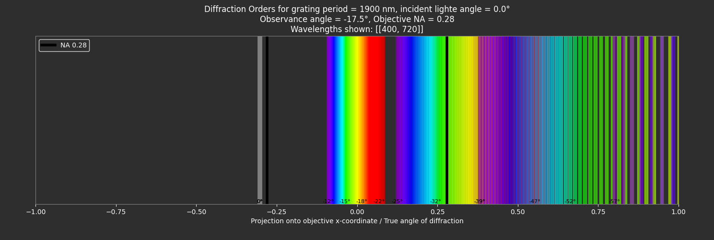

# Simulation of structural colors from periodic grating 

Run main.py to choose simulation. 

## Simulation 1: Diffraction Orders Overview

## Simulation 2: Objective View Plot

## Simulation 3: Rotatinator View Plot

