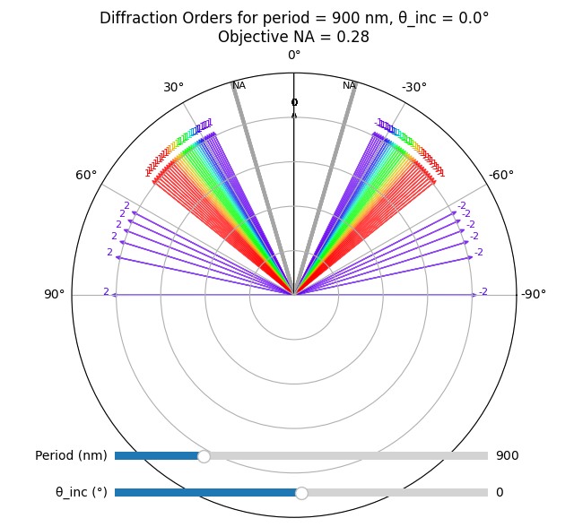

# Calculation of Structural Colors from Periodic Gratings

Run main.py to choose program. The programs to choose from are listed below.  

## Simulation 1: Diffraction Orders Overview

## Simulation 2: Rotate Viewing Angle Plot

## Simulation 3: CIE View Plot

